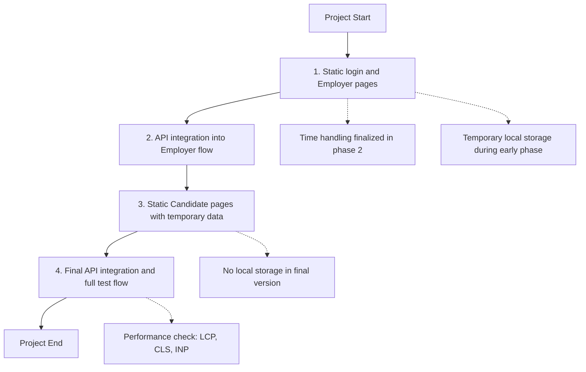

## Tech Stack

- `Next.js 16`
- `React 19`
- `TypeScript`
- `Redux Toolkit`
- `React Hook Form`
- `Yup`
- `Tailwind CSS v4`
- `Axios`

## Links

- Live Demo: [https://akij-ibos.vercel.app/dashboard](https://akij-ibos.vercel.app/dashboard)
- Backend API Health: [https://akij-ibos-backend.vercel.app/api/health](https://akij-ibos-backend.vercel.app/api/health)
- Video Walkthrough: [https://www.youtube.com/watch?v=VHrNKdRJ_qw](https://www.youtube.com/watch?v=VHrNKdRJ_qw)
- Backend Repository: [https://github.com/Iam-Zarif/akij-ibos-backend](https://github.com/Iam-Zarif/akij-ibos-backend)

## APIs Used

### Authentication

- `POST /api/auth/login`
- `GET /api/auth/me`

### Online Tests

- `GET /api/online-tests`
- `POST /api/online-tests`
- `GET /api/online-tests/:testId`
- `PUT /api/online-tests/:testId/basic-info`
- `POST /api/online-tests/:testId/questions`
- `DELETE /api/online-tests/:testId/questions/:questionId`
- `POST /api/online-tests/:testId/publish`

### Utility

- `GET /api/health`

## Serial Work Plan

## QA From task

### MCP Integration

- I have not used MCP directly in production yet.
- My understanding is that MCP is an open standard for connecting AI applications with tools, services, and external resources.
- In this kind of project, MCP could be useful for Figma-to-code workflows, browser debugging, or tool-assisted backend operations also in AI agents, chat apps, coding tools, and systems that need access to APIs, files, databases, or external services.

### AI Tools for Development

- I use `ChatGPT` for planning, debugging, and documentation.
- I also recommend `Claude` for deeper reasoning and structured problem solving.
- These tools help speed up development, but I always verify the final code, logic, and implementation decisions myself.
- If time is too short, I prefer Claude AI

### Offline Mode

- I would use `IndexedDB`, preferably with `Dexie.js`, to save answers locally.
- I would cache the app shell and static assets with a service worker or `Workbox`.
- I would preserve timer state and exam progress locally to reduce data loss risk.
- Once the connection returns, the app would sync unsaved progress back to the server.
