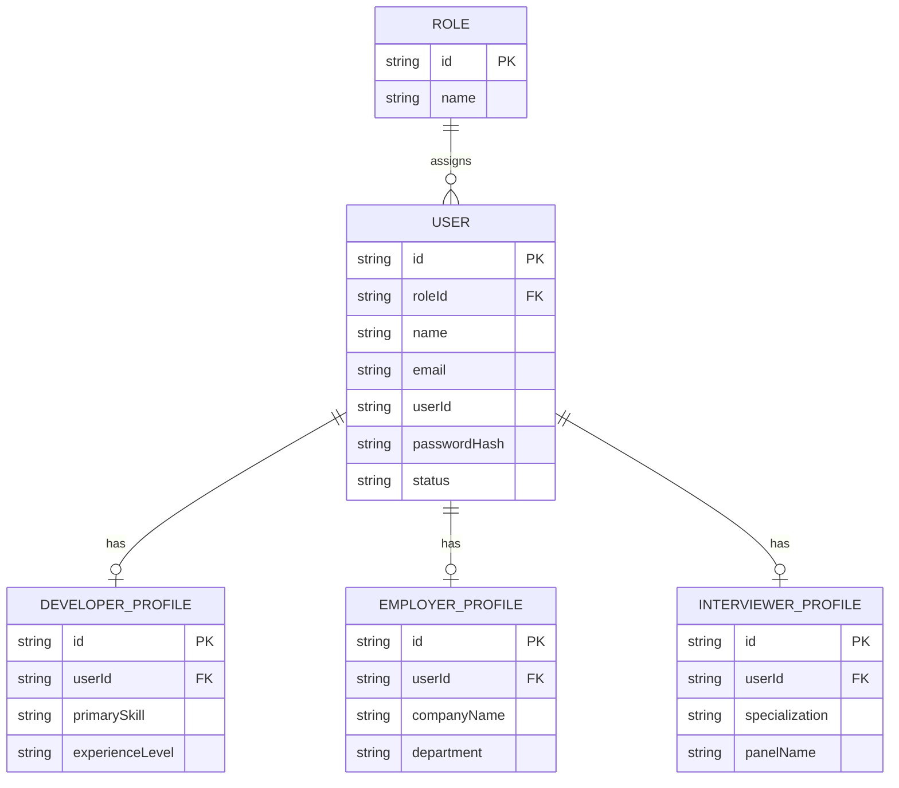

# Auth ER Diagram

```mermaid
erDiagram
    ROLE ||--o{ USER : assigns
    USER ||--o| DEVELOPER_PROFILE : has
    USER ||--o| EMPLOYER_PROFILE : has
    USER ||--o| INTERVIEWER_PROFILE : has

    ROLE {
      string id PK
      string name
    }

    USER {
      string id PK
      string roleId FK
      string name
      string email
      string userId
      string passwordHash
      string status
    }

    DEVELOPER_PROFILE {
      string id PK
      string userId FK
      string primarySkill
      string experienceLevel
    }

    EMPLOYER_PROFILE {
      string id PK
      string userId FK
      string companyName
      string department
    }

    INTERVIEWER_PROFILE {
      string id PK
      string userId FK
      string specialization
      string panelName
    }
```
